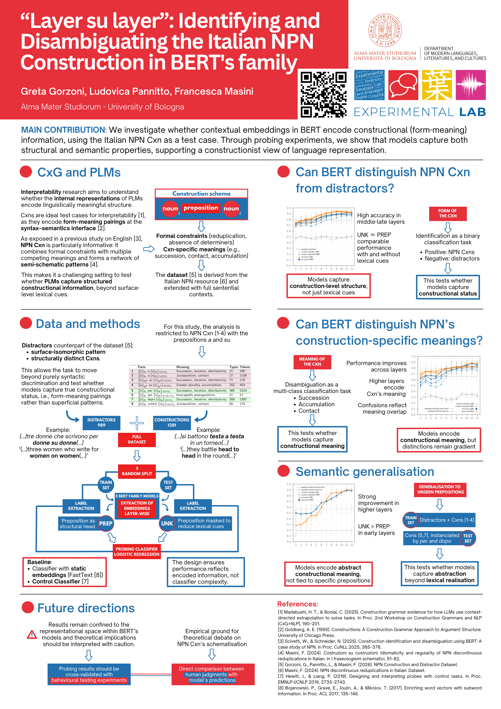

# NPN: Identifying and Disambiguating the Italian NPN Construction in BERT's Family

Repository for the CMCL 2026 paper:

> **Gorzoni, G., Pannitto, L., & Masini, F. (2026).**  
> *“Layer su Layer”: Identifying and Disambiguating the Italian NPN Construction in BERT’s Family.*  
> Proceedings of CMCL 2026.

---

## Overview

This repository contains the code, datasets, and supplementary materials for the study of the Italian **NPN (noun–preposition–noun)** constructional family (e.g. *strato su strato*, *faccia a faccia*, *giorno dopo giorno*) within a **Construction Grammar** and **interpretability** framework.

The project investigates whether and to what extent contextual embeddings extracted from BERT-family models encode constructional information. The experiments are based on probing classifiers trained over contextual embeddings extracted across BERT layers.

---

## Repository Structure

```bash
NPN/

│
├── data/                           # datasets, annotation files, train/test splits, and extracted embeddings
│   │
│   ├── _legacy/                    # deprecated or previous experimental versions of datasets/scripts
│   │
│   ├── agreement/                  # inter-annotator agreement files and evaluation material
│   │
│   ├── data_set/                   # final curated datasets used in the experiments
│   │
│   ├── embeddings/                 # extracted contextual embeddings (.csv/.pkl) from BERT layers
│   │
│   ├── output/                     # outputs of probing experiments, predictions, and metrics
│   │
│   ├── source/                     # raw source data extracted from CORIS and preprocessing resources
│   │
│   ├── tokenizer/                  # tokenizer resources and tokenized intermediate files
│
│
├── src/                            # main Python source code for preprocessing, probing, and evaluation
│
├── pipeline_cmcl_ex1.md            # step-by-step pipeline description for CMCL Experiment 1
├── pipeline_cmcl_ex2.md            # step-by-step pipeline description for CMCL Experiment 2
│
├── requirements.txt                # Python dependencies required to reproduce the experiments
│
└── README.md                       # project documentation

```

---

## Probing Experiments

The probing pipeline:

1. extracts contextual embeddings from BERT-family models
2. probes embeddings layer-by-layer
3. evaluates:
   - construction identification
   - semantic disambiguation
4. compares:
   - `[UNK]` embeddings
   - `PREP` embeddings
   - FastText baselines
   - control classifiers

---


## Reproducing the experiments

To reproduce the experiments, first create and activate a Python virtual environment, then install the required dependencies:

```bash
python -m venv .venv
source .venv/bin/activate   # macOS/Linux
pip install -r requirements.txt
```

The repository is organized as a modular pipeline covering dataset preparation, contextual embedding extraction, probing classification, and evaluation.

Detailed step-by-step instructions for reproducing the experiments presented in the CMCL 2026 paper are available in:

- `pipeline_cmcl_ex1.md` — construction identification experiments
- `pipeline_cmcl_ex2.md` — semantic disambiguation experiments


# Related Resources

## PCA Visualizations

Interactive PCA visualizations of contextual embeddings across Transformer layers are available here:

https://gretagorzoni00.github.io/NPN_contextual_embeddings/

The visualizations provide a geometric exploration of the embedding space for:

- NPN constructions vs distractors
- semantic clusters
- layer-wise representation dynamics

### Paper

[CMCL 2026 paper — forthcoming]

### Dataset (Zenodo)

The data are based on the Italian NPN constructional family described in Masini (2024).

[[Zenodo dataset link](https://zenodo.org/records/18716255)]

### Poster

[](assets/poster_cmcl2026.pdf)

Click on the image to open the full poster PDF.

---

## Citation

```bibtex
@inproceedings{gorzoni2026layersulayer,
  title={“Layer su Layer”: Identifying and Disambiguating the Italian NPN Construction in BERT’s Family},
  author={Gorzoni, Greta and Pannitto, Ludovica and Masini, Francesca},
  booktitle={Proceedings of CMCL 2026},
  year={2026}
}
```

---
